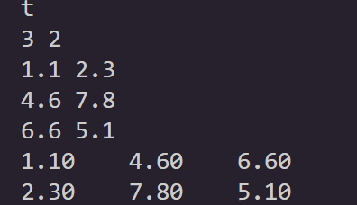

# algebra
## 一、加法/减法
* 本质上是一样的，先判断两个矩阵的行列是否一致，在对应位置的加减即可，这里直接给出测试结果 

## 二、乘法/数乘
* **乘法**先判断a的列数与b的行数是否一致，再按照乘法基本规则计算（此处n为a的列数）
* **数乘**是矩阵每个数与k相乘即可，这里刚开始不知道为什么没有输入k，最后发现main函数中已经指明 $k=2$

$$ c_{ij}=\sum_{k=0}^{n}a_{ik}b_{kj}$$

* 测试结果
  
  

## 三、转置
* 新建一个矩阵，元素一一赋值即可
  
  $$ c_{ij} = a_{ji}$$

* 测试结果
  

## 四、行列式
* 先判断是否为n×n型，是的话找按照主元、对换位置（如果当前行不是主元所在行）、消元即可。
* 这里注意到main函数中无论是否存在行列式，最终都会 $ printf~det$ ,所以还是会输出0.00，由于本身模板中就是 $return~0$ ，所以这里就不加修改了。
* 特殊情况若主元为0，则行列式为0
* 测试结果
  

## 五、逆矩阵
* 矩阵求逆的思路就是，先找伴随矩阵，求行列式，再算逆矩阵
伴随矩阵：

$$A^*=(A_{ij})^T ，A_{ij}为A中a_{ij}的代数余子式\\
A^{-1}=\frac{1}{|A|}A^*
$$

* 测试结果
 

## 六、秩
* 和行列式有些类似，找主元、高斯消元，非0行的数量即为矩阵的秩
* 每次找到一个非0主元，则非0行+1，秩一定不大于行数
* 测试结果
 

## 七、迹
* 先确定是否为方阵，是的话对角线上的元素相乘即可

$$t=\prod_{i=0}^{n}a_{ii}$$

* 测试结果
 